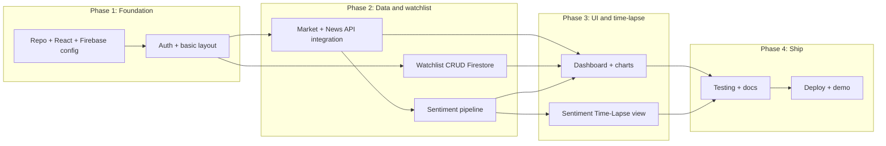

# TradeSense Team Implementation Plan

This plan is based on the [491 - Project Proposal - Google Docs.pdf](file:///Users/navidnikoo/Library/Application%20Support/Cursor/User/workspaceStorage/ca98a6bc276c9e1e346fa4f77f1656ac/pdfs/72f3966d-6cbb-4efc-a885-9d9ad852a223/491%20-%20Project%20Proposal%20-%20Google%20Docs.pdf) and is intended to be shared with the team so work can be divided. Each phase maps to the proposal's Release Plan (Section 12.0); tasks are sized so one person can own a slice with clear inputs/outputs.

---

## Tech Stack (from proposal Section 8.0)

- **Frontend:** React, JavaScript, HTML, CSS (VS Code)
- **Backend / Auth / DB:** Firebase (Authentication, Firestore)
- **Optional:** Node.js for API proxy or serverless (e.g. sentiment API)
- **Deploy:** Firebase Hosting
- **APIs (to be chosen):** Stock/market data API, financial news API
- **Sentiment:** Pretrained financial model (e.g. FinBERT via Hugging Face API or a small backend)

---

## High-Level Dependency Flow

---

## Phase 1: Foundation (Release 1 – proposal Section 12.0)

**Goal:** Project runs locally, Firebase is wired, users can sign up and sign in, and there is a minimal shell (e.g. dashboard placeholder after login).

| Task                           | Owner                   | Deliverables                                                                                                                     | Hand-holding notes                                                                                                          |
| ------------------------------ | ----------------------- | -------------------------------------------------------------------------------------------------------------------------------- | --------------------------------------------------------------------------------------------------------------------------- |
| **1.1 Repo and React app**     | Lead (Navid) or one dev | `package.json`, React app with React Router, `.env.example` for Firebase and API keys, README with `npm install` and `npm start` | Use Create React App or Vite; add ESLint/Prettier so everyone has same format.                                              |
| **1.2 Firebase project**       | Lead                    | Firebase project (Auth + Firestore), `firebase.json`, security rules skeleton, env vars documented                               | Create project in Firebase Console; enable Email/Password auth; create a `users` (or similar) collection.                   |
| **1.3 Auth (sign up / login)** | Dev A                   | Login page, Sign-up page, auth context/hook, redirect to dashboard when logged in, sign-out                                      | Use Firebase Auth `createUserWithEmailAndPassword` and `signInWithEmailAndPassword`; store user in context; protect routes. |
| **1.4 App shell and layout**   | Dev B                   | Top nav (logo, user email, logout), sidebar or tabs for “Dashboard” and “Watchlist”, placeholder Dashboard and Watchlist pages   | Simple responsive layout; no real data yet; match proposal Figures 1–2 loosely.                                             |

**Exit criteria:** New user can register, log in, see the shell, and log out. No market data or watchlist yet.

---

## Phase 2: Data and Watchlist (Release 2)

**Goal:** External market + news data is available in the app, watchlist is stored in Firestore, and a first version of sentiment scoring exists.

| Task                       | Owner                 | Deliverables                                                                                                                                                                                                | Hand-holding notes                                                                                                                             |
| -------------------------- | --------------------- | ----------------------------------------------------------------------------------------------------------------------------------------------------------------------------------------------------------- | ---------------------------------------------------------------------------------------------------------------------------------------------- |
| **2.1 Market data API**    | Dev A or Lead         | One service/module that fetches current + historical price for a given ticker (e.g. Alpha Vantage or Yahoo Finance); rate-limit handling and env-based API key                                              | Keep all API keys in env; return a simple shape like `{ symbol, price, history: [{ date, close }] }` so UI does not depend on provider.        |
| **2.2 News API**           | Dev B                 | One service that fetches financial news for a given ticker (e.g. Alpha Vantage News, NewsAPI, or similar); return list of `{ title, url, publishedAt, source }`                                             | Same pattern: env key, single module, consistent response shape. Document rate limits.                                                         |
| **2.3 Watchlist CRUD**     | Dev C                 | Firestore collection `watchlists` (or per-user subcollection) keyed by `userId`; add/remove/reorder tickers; React hooks to load and update watchlist                                                       | Firestore rules: user can read/write only their own watchlist. Expose `useWatchlist(userId)` that returns `{ symbols, add, remove, reorder }`. |
| **2.4 Sentiment pipeline** | Lead or strongest dev | For a list of news headlines/snippets, return sentiment (e.g. positive/negative/neutral) per item and optionally an aggregate score; use pretrained FinBERT (Hugging Face API or small Node/Python service) | Proposal: no custom training; use pretrained model. Output a simple interface so dashboard and time-lapse can consume the same scores.         |

**Exit criteria:** User can add tickers to watchlist (persisted); for a ticker, app can show price + news; sentiment scores are available for that news (even if UI is minimal).

---

## Phase 3: Dashboard and Sentiment Time-Lapse (Release 3)

**Goal:** Unified dashboard (proposal Section 6.1) and Sentiment Time-Lapse (Section 6.1.2, Figure 3) are implemented and usable.

| Task                          | Owner | Deliverables                                                                                                                                                                                                          | Hand-holding notes                                                                                                                                          |
| ----------------------------- | ----- | --------------------------------------------------------------------------------------------------------------------------------------------------------------------------------------------------------------------- | ----------------------------------------------------------------------------------------------------------------------------------------------------------- |
| **3.1 Dashboard per ticker**  | Dev A | For each watchlist symbol: price (and simple trend), recent news list, and sentiment summary (e.g. “Positive” / “Negative” / “Neutral” with a short explanation)                                                      | Reuse services from Phase 2; keep component presentational where possible; use a small chart library (e.g. lightweight charts or Recharts) for price trend. |
| **3.2 Dashboard layout**      | Dev B | Single dashboard page that loads user’s watchlist and renders the per-ticker blocks; loading and error states; “Add from watchlist” or link to watchlist management                                                   | Responsive grid or list; clear labels so it matches “unified dashboard” in the proposal.                                                                    |
| **3.3 Time-Lapse data model** | Lead  | Define how time-lapse “snapshots” are stored (e.g. `sentiment_snapshots` or `time_lapse` collection: `userId`, `symbol`, `timestamp`, `sentimentSummary`, optional price snapshot); document schema in README or docs | Enables “hourly snapshots” and “scroll back in time” from proposal; can be written by a scheduled job or on-demand when user enables time-lapse.            |
| **3.4 Time-Lapse UI**         | Dev C | Time-Lapse view: select a symbol (from watchlist), choose date range, see timeline of sentiment (+ optional price) over time; “Enable Time-Lapse” for a symbol if not already                                         | Match Figure 3 idea: clear, simple visualization (e.g. timeline or stepper); use existing sentiment + price data.                                           |

**Exit criteria:** User sees one dashboard with watchlist symbols, price, news, and sentiment; user can open Sentiment Time-Lapse for a symbol and review how sentiment (and optionally price) changed over time.

---

## Phase 4: Testing, Docs, and Deploy (Release 4)

**Goal:** Functional and integration testing, user-facing docs, and deployment per proposal Section 9.0 and 12.0.

| Task                    | Owner   | Deliverables                                                                                                                                        | Hand-holding notes                                                                              |
| ----------------------- | ------- | --------------------------------------------------------------------------------------------------------------------------------------------------- | ----------------------------------------------------------------------------------------------- |
| **4.1 Testing**         | Split   | Smoke tests: auth flow, add/remove from watchlist, dashboard loads; one integration path: login → watchlist → dashboard → time-lapse for one ticker | No need for full coverage; focus on “critical path” so regressions are caught.                  |
| **4.2 User guide**      | One dev | Short step-by-step user guide: sign up, log in, create watchlist, read dashboard, use Sentiment Time-Lapse (proposal Section 9.0)                   | Screenshots and bullet steps; can live in repo as `docs/USER_GUIDE.md` or in the report.        |
| **4.3 Deploy and demo** | Lead    | Deploy to Firebase Hosting; env configured for production (e.g. Firebase config); demo script for final presentation                                | Proposal: “deployed as a browser-based web application”; final report and demo as per schedule. |

---

## Suggested Role Split (for a 4-person team)

- **Lead (Navid):** Repo setup, Firebase project, sentiment pipeline (2.4), time-lapse data model (3.3), integration of others’ work, deploy (4.3).
- **Dev A:** Auth (1.3), market data API (2.1), dashboard per ticker (3.1).
- **Dev B:** App shell/layout (1.4), news API (2.2), dashboard layout (3.2).
- **Dev C:** Watchlist CRUD (2.3), Time-Lapse UI (3.4); can also own user guide (4.2).

If the team is smaller, Phase 1 can be done by 1–2 people; Phases 2–3 should still be split so one person owns “data/APIs,” one “Firestore/watchlist,” and one “sentiment + time-lapse” with Lead integrating.

---

## Risks and Mitigations (from proposal Section 11.0)

- **API rate limits / outages:** Implement request throttling, caching (e.g. in-memory or Firestore for recent responses), and document fallback or alternative APIs in README.
- **Integration breakage:** Integrate early (e.g. branch per phase); Lead does a short “integration checkpoint” when each phase’s tasks are done.
- **Timeline:** Stick to MVP; defer “nice-to-haves” (e.g. advanced technical indicators, extra chart types) until core dashboard and time-lapse work.

---

## Where to Start (for the team)

1. **Everyone:** Clone repo, run `npm install` and `npm start`, and create a test Firebase user.
2. **Phase 1 owners:** Start with 1.1 (if Lead hasn’t) and 1.2, then 1.3 and 1.4 in parallel once Firebase and routes exist.
3. **Phase 2 owners:** Wait for Firestore and auth (Phase 1); then 2.1 and 2.2 can proceed in parallel; 2.3 needs Firestore rules from Lead; 2.4 can start once 2.2 returns news text.
4. **Phase 3 owners:** Start only after Phase 2 deliverables are merged; 3.1 and 3.2 depend on 2.1, 2.2, 2.4; 3.4 depends on 3.3 and existing sentiment/price data.

This plan can be copied into a shared doc or `docs/IMPLEMENTATION_PLAN.md` in the repo so the team always has one source of truth for phases, tasks, and ownership.